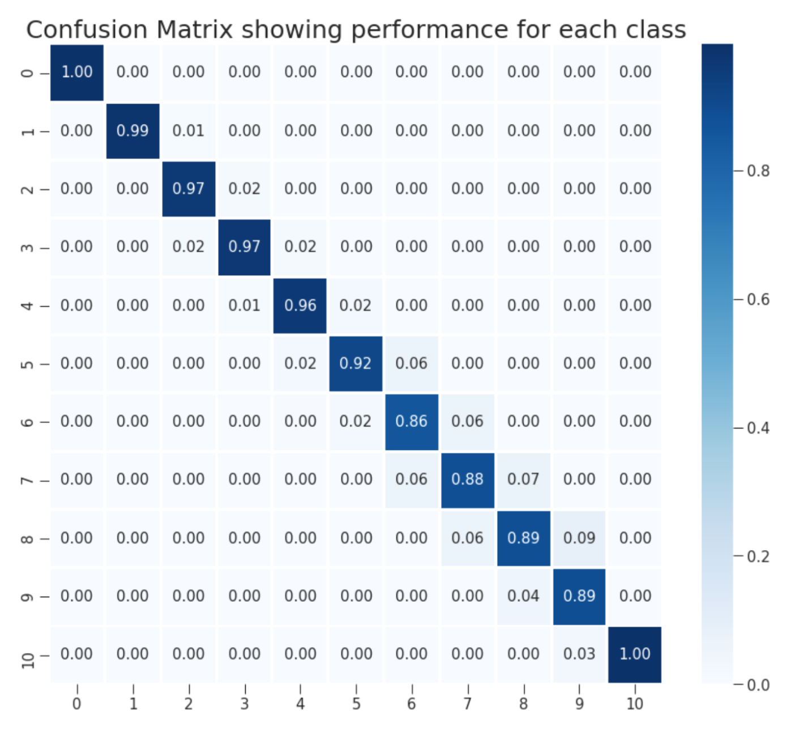
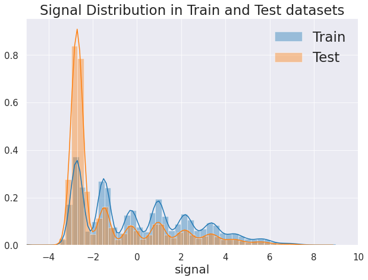

# Deep-channel-predictor
**Bi-LSTM based model to predict open ion-channels**

Many diseases, including cancer, are believed to have a contributing factor in common. Ion channels are pore-forming proteins present in animals and plants. They encode learning and memory, help fight infections, enable pain signals, and stimulate muscle contraction. If scientists could better study ion channels, which may be possible with the aid of machine learning, it could have a far-reaching impact.

When ion channels open, they pass electric currents. Existing methods of detecting these state changes are slow and laborious. Humans must supervise the analysis, which imparts considerable bias, in addition to being tedious. These difficulties limit the volume of ion channel current analysis that can be used in research. Scientists hope that technology could enable rapid automatic detection of ion channel current events in raw data.

**raw_data** is obtained from here : https://www.kaggle.com/c/liverpool-ion-switching/data

**data-without-drift** is obtained from here : https://www.kaggle.com/cdeotte/one-feature-model-0-930/data

This repository is based on kaggle competition called 'liverpool-ion-switching' (https://www.kaggle.com/c/liverpool-ion-switching).

Jupyter notebook 'Remove_Drift+Class_Reweighing+Bi-LSTM.ipynb' contains some initial analysis and a Bi-LSTM model.

 

Model specifications are : 

|     Method    |   Numbers
| ------------- | ------------- |
|       LSTM    | 3  layers |
| Droput Value  | 0.5       |
| Bidirectional | 3 layers  |
| Optimizer     | adam    |
| Class reweighing | yes (μ=0.15)    |
| Sequence Length | 1000 |
| Nodes | 256|
|Batch size | 128 |
| Learning Rate | 0.001 |
|Accuracy Score | 0.969 |
|F1 Score  |    0.939|
|Precision Score | 0.939|
|Recall Score | 0.939|
| Submission Score | 0.934|

